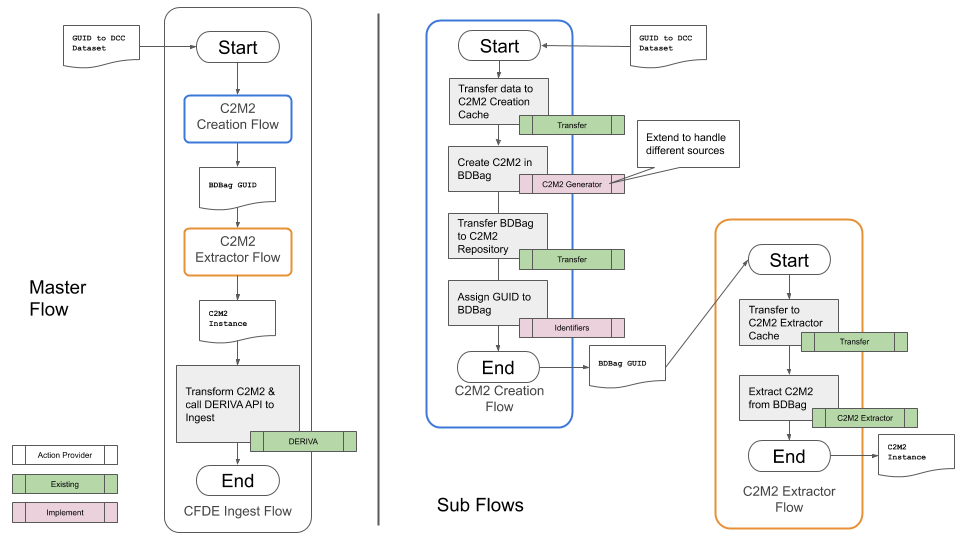
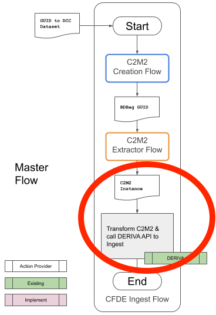

# Ingesting metadata from NIH Common Fund Data Coordinating Centers

*Goal*: Enable data discovery and FAIRness evaluation for the NIH Common Fund Data Coordinating Centers

*Method*: Create an automated pipeline that ingests metadata manifests from each Data Coordinating Center into [DERIVA](https://docs.derivacloud.org/), a discovery engine

* Vision - A pipeline for ingesting metadata manifests
* The pipeline - End to end
* Current status
* Next steps

## Vision - A pipeline for ingesting metadata manifests

The NIH Common Fund sponsors a portfolio of biomedical research initiatives, each of which generates considerable data. For example, the [Kids First](https://kidsfirstdrc.org/) initiative gathers clinical data from childhood cancer treatment programs, including genetic samples, tissue samples, and other clinical data for childhood cancer patients and their family members. Each Common Fund initiative includes a Data Coordination Center (DCC), responsible for gathering and managing the data for the initiative and encouraging its use in research programs.

Common Fund initiatives last up to ten years each, and initiatives begin and end on a rolling basis over time. Maintaining awareness of the overall Common Fund data inventory (all the data collected by all the DCCs) is important for at least two reasons. First, it helps ensure that the data can be used by appropriate research programs. Second, it helps ensure that the resources to maintain the data remain available over time, even when the initiative that produced the data has completed.

To maintain this awareness of the Common Fund's data assets over time, the Common Fund Data Ecosystem (CFDE) project is developing an automated pipeline for ingesting (importing) a series of manifests (inventories) from each Common Fund DCC. These inventories are ingested into a centralized CFDE discovery engine (based on the DERIVA tool from USC's Information Sciences Institute) where they become browsable and searchable in a variety of ways. The resulting CFDE inventory is available to NIH and the biomedical research community at large to understand the data the Common Fund DCCs have produced.

An automated pipeline is important because the active DCCs are continuously adding to and adjusting their data assets. As updated manifests are produced, they must be ingested into DERIVA and carefully merged with previous versions without duplicating or losing previous information. Given the scale of data produced by the DCCs, the aggregate effort of ingesting, matching, and merging these ever-changing manifests from all of the DCCs is substantial, which is why we need an automated process.

## The pipeline - End to end

Figure 1 shows a complete CFDE metadata ingest pipeline for a single DCC. The complete pipeline (Master Flow) is shown on the left, and the details of two sub-flows (the C2M2 Creation Flow and the C2M2 Extractor Flow) are shown on the right.

Figure 1. A complete CFDE metadata ingest pipeline

The pipeline begins with the DCC providing a GUID (Globally-Unique IDentifier) for an updated metadata manifest. The first stage of the pipeline, the C2M2 Creation Flow, transfers the metadata manifest from the DCC to a temporary staging area. It then reformats the data (if necessary) into a standardized format (C2M2) used across all Common Fund programs. The C2M2 format ensures that similar data from different DCCs is described in the same way in the Common Fund inventory. The C2M2 version of the manifest is packaged in a reusable format that ensures all parts are present and accounted for when the data is copied, moved to a CFDE repository for long-term storage, and a new GUID is assigned.

The next stage of the pipeline, the C2M2 Extractor Flow, picks up with the GUID produced by the previous stage. It retrieves the C2M2 version of the manifest from the CFDE repository, extracts the data from its package, and delivers it to the final step of the pipeline.

The final step of the pipeline (back in the Master Flow on the left of Figure 1) takes the C2M2 version of the updated DCC manifest and ingests the new manifest into DERIVA. The manifest is carefully merged to ensure that the new manifest's data is matched with earlier versions in DERIVA, avoiding data duplication and data loss.  

## Current status

Figure 2 shows only the Master Flow from Figure 1. The red circle highlights the part of the flow completed at this time.

Figure 1. The completed portion of the CFDE metadata ingest pipeline

The completed portion of the pipeline is the step that accepts an updated manifest from a DCC in the C2M2 format and adds it to the CFDE catalog in DERIVA.

This step uses the DERIVA API (application programmer interface) to add the manifest update to the catalog. Beyond the C2M2 manifest update and the code that calls the DERIVA API, this step of the pipeline also needs a credential that it can use to authenticate with the DERIVA API. The credential must be authorized to update the DERVIA catalog.

## Next steps

With the last step of the CFDE metadata ingest pipeline implemented, we can populate the DERVIA catalog with sample data generated "by hand" to demonstrate DERIVA's discovery features. We are using GTex metadata created by the NIH DCPPC project to do this.

Subsequent work will implement the earlier two sub-flows in the pipeline: the C2M2 Creation Flow and the C2M2 Extractor Flow. These flows will most likely need to be interated on as we obtain manifests from other DCCs, such as HMP/iHMP, Kids First, Metabolomics, and LINCS. The addition of each DCC (and subsequent manifest updates) will reveal complexities that the pipeline must handle.

[back](./)
