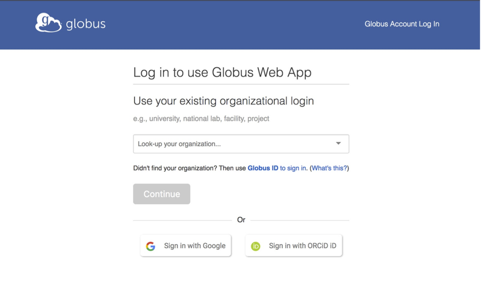
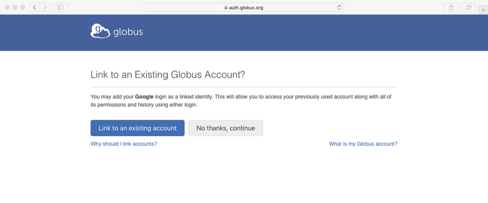
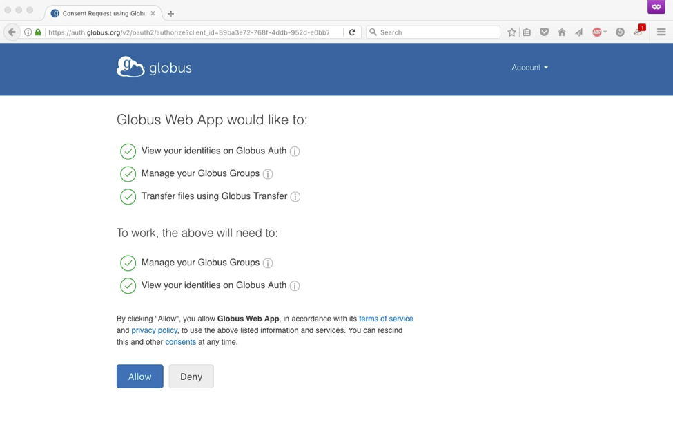
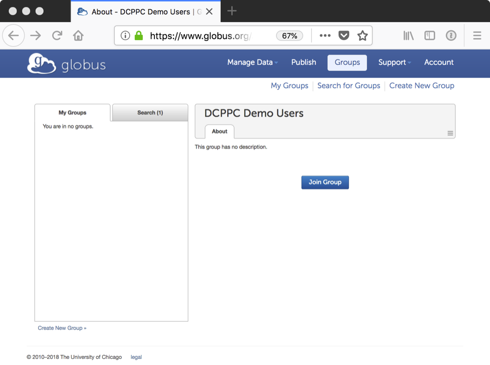
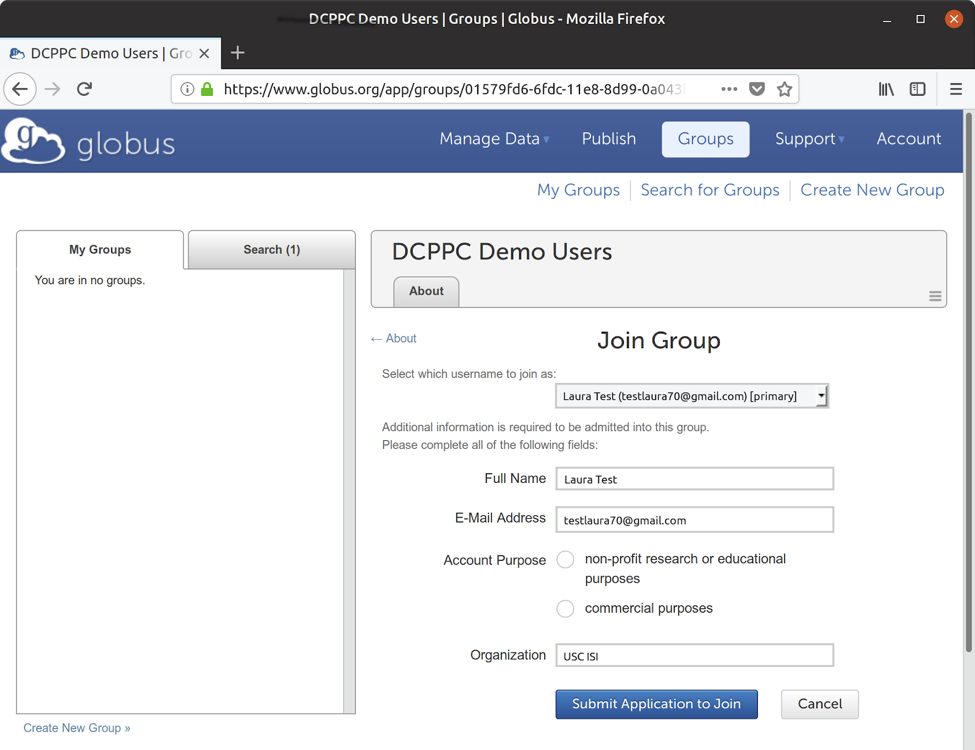

# Team Argon DCPPC Pilot Users Onboarding Instructions

This page describes how to get access to the Globus DCPPC Demos and related datasets. We use Globus Groups to securely manage these permissions and Globus Auth to authenticate your identity. Following these instructions will get you set up with both.

## Step 1: Locate the DCPPC Demo Users Group

Click on the button below to locate the DCPPC Demo Users group in Globus. *If you aren’t already logged in to Globus, you’ll be asked to login when you click this link. See Step 2. If you’re already logged in to Globus, you can skip directly to Step 5.*

## Step 2: Choose How to Log In

If you are already logged in to Globus, you can skip directly to Step 5. 
Clicking the button above will require you to login. You’ll see a Globus login page where you can choose your identity provider.

Choose one of the following and log in accordingly:
* __Your academic/research institution__, if it’s in the list. (Most are.)
* __National Institutes of Health__, if you have an iTrust ID. (eRA Commons is not yet supported by Globus, but it will be soon.)
* __ORCID__, if you have an ORCID ID.
* __Google__, if none of the above are available to you

__NOTE:__ If you see a page like the one below and have an account you've used before with Globus, click "Link to an existing account." If not, click "No thanks, continue." *If you’ve used Globus before with a different identity and you link that identity here, Globus will recall your information and you’ll skip directly to Step 5.*

## Step 3: Complete Short Signup Form

Complete your signup by providing your organization, agreeing to our terms of service, etc.

## Step 4: Provide Consent

A consent page appears. Globus is asking for permission to use the identity returned by your identity provider, manage your group memberships, and transfer files for you. Click "Allow".

## Step 5: Join Group

You will now see the DCPPC Demo Users group page. Click "Join Group”.

## Step 6: Submit Application to Join

Now, you must complete your request to join the group. Click the pulldown menu labeled "Select which username to join as" and find the identity that appears on the DCPPC whitelist.  (This will usually be an identity from your home institution, but in some cases it might also be an "nihdatacommons.us" identity.)  If you do not see your whitelisted identity in the pulldown list, then you will have to logout of Globus (click "Account" in the upper-right corner and select "Logout") and return to Step 2.

Fill in some informational fields and click "Submit Application to Join.”

You’ll receive an email notification that your membership is pending.

## Approval

Once the administrator approves your application, you’ll receive email confirmation like the one below, stating that your membership has been approved. You will now have access to Globus’ DCPPC Demos.

Now that you are a member of the DCPPC Demo User group, you can click the “Login” button on the Globus FAIR Data Portal and you’ll automatically have access to the DCPPC data allowed by the group.

If you have any problems or questions, please email us at ___________________.

[back](./)
