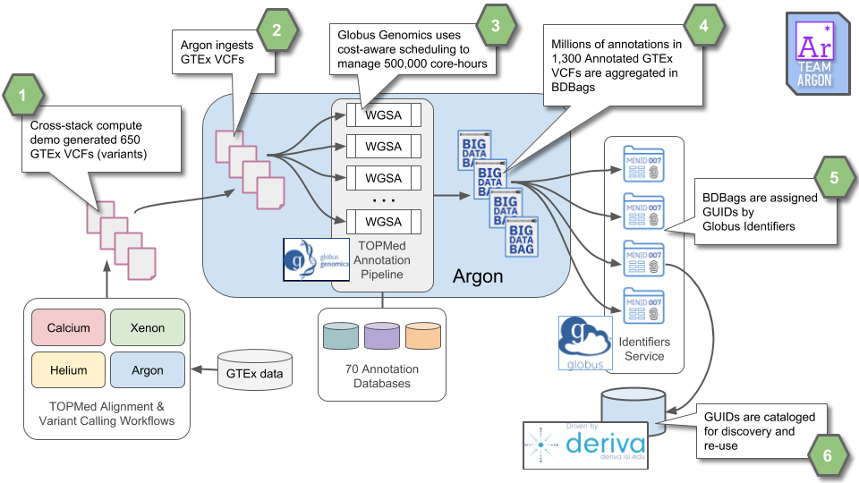

# Rapid Annotation of GTEx Genomic Variants with the TOPMed Annotation Pipeline

*Goal*: Rapidly and reliably aggregate variant annotations for large volumes
of whole genome sequence data, with results that are findable,
accessible, interoperable, and reusable: FAIR.

*Method:* Leverage cloud computing and Commons tools to run the Whole Genome
Sequence Annotator (WGSA) on many GTEx genomes, with identifiers,
virtual cohorts, and reproducible pipelines used pervasively to ensure
FAIRness. 

## Scalable, Cost-Controlled Analysis for Data Enrichment

Large quantities of genome data are now available, but genome-wide
association studies that depend on rare variants lack statistical
power. Combining annotations from many sources provides a
comprehensive “genome map” boosting statistical power of association
studies. We demonstrate a high performance, parallel implementation of
TOPMed’s annotation pipeline that uses 70 annotation databases to
annotate the SNPs and Indels from 608 GTEx variant (VCF) files to
create a data resource of millions of annotated variants that can then
be used in genome-wide association studies. Each annotation process
takes roughly 24 hours to complete on a 32-core node, for a total of
roughly 500,000 core-hours. The annotation pipeline uses cost-aware
provisioning to perform annotation on a compute cluster using spot
instances on the Amazon cloud.

## Re-Use of Data

This example highlights Re-Use and interoperability of data and
computational tools. The variant files come from the DCPPC Cross-Stack
Compute Demo while the annotation tool is from the TOPMed project. The
annotations are scaled across the input data using cost-aware cloud
provisioning to create a rapid yet inexpensive pipeline. The results
are packaged for sharing by using BDBags as a common data exchange
format and referenced by GUIDs with agreed upon metadata
conventions. Because the tools and services comprising this
architecture build on interoperable components (e.g., OAuth2/OIDC used
by Globus Auth) additional patterns emerge. This workflow can be
driven from by a Jupyter notebook, beginning with calls to DERIVA or
another portal for cohort creation, through the computation and its
requisite data handling, and back to DERIVA to associate the results
with the original cohort.

## The Data

The annotated VCFs are being aggregated into BDBags and assigned Minids (a type of KC2 GUID, [here's an example](https://identifiers.globus.org/ark:/57799/b95E1DXjoyity0)). We've made an [initial pull request](https://github.com/dcppc/full-stacks/pull/41) into the DCPPC Full Stacks repository to share these identifiers with the other teams. We'll update the new file created in that pull request (`gtex-wgs-annotated-vcf-wgsa.tsv`) as the annotation runs complete via additional pull requests. Also, the Minids will be ingested into our [DCPPC instance](https://nih-commons.derivacloud.org) of [DERIVA](http://docs.derivacloud.org) to tie these new files back to the original sequences.

## Slides

Check out [this presentation](6M.2.DEMOArgon.pdf) for more details about the science and components. 

[back](./)
